# Inference as a New Frontier: A Data-Movement-Centric Analysis of Large-Model Serving and Reinforcement Learning Rollouts

**Prasuna Chatla** · Independent Researcher · September 2026

# Abstract

Large-model inference is the recurring workload of interactive services, reasoning systems, agents, evaluation pipelines, and reinforcement-learning (RL) post-training. Its performance often depends less on peak arithmetic throughput than on the movement, placement, precision, and lifetime of weights, activations, key–value (KV) state, and distributed trajectories. This technical survey develops a data-movement-centric analysis organized around bytes moved per useful token. A first-order dense-model calculation separates batch-amortized weight reads from private KV reads and identifies a context-dependent ceiling on the parameter-FLOP traffic proxy, with attention arithmetic and memory-capacity limitations stated explicitly. The analysis connects paged KV management, prefix reuse, IO-aware attention, continuous batching, chunked prefill, speculative decoding, weight/activation/KV quantization, prefill/decode disaggregation, latency–throughput trade-offs, and sparse mixture-of-experts serving. RL rollouts introduce additional requirements for policy versions, numerical consistency, environment interaction, and weight redistribution. A further analytical extension accounts for generation and evaluator inference in self-improvement loops, distinguishing bytes per verified improvement from quality gain per joule. These proposed metrics do not establish autonomous improvement or convergence. The paper combines derived calculations, source-grounded architectural redraws, and reported experimental points; it does not claim new accelerator measurements. The resulting design agenda combines locality, compressed data paths, flexible precision, efficient collectives, and phase-specific scheduling with explicit verification contracts: faster inference is valuable only when the resulting work remains useful and credibly evaluated.

**Index Terms—** large-model inference, KV cache, paged attention, continuous batching, speculative decoding, quantization, prefill/decode disaggregation, time to first token, goodput, mixture of experts, reinforcement learning rollouts, self-improvement, evaluation, data movement, inference accelerators.

# I. Introduction

Inference has become the operational substrate of modern artificial intelligence. A model may be trained a limited number of times but served for billions of requests. Test-time reasoning purchases quality with additional forward passes. Agentic systems repeatedly re-enter the model with growing histories, retrieval results, tool schemas, and environment observations. Post-training systems generate many candidate trajectories before computing a comparatively small number of parameter updates. Across these settings, forward execution determines latency, capacity, energy, cost, and iteration speed.

Reducing the problem to matrix multiplication is misleading. Model weights must reach the arithmetic units; KV entries must be retained and reread; activations may be materialized or fused; tensor-parallel reductions and expert dispatch may cross devices; and rollout weights may be redistributed between training and inference layouts. Peak FLOP/s ignores whether the operands can be delivered. Aggregate tokens/s can conceal unacceptable tail latency. Parameter count ignores transient state and distributed communication.

The physical asymmetry is persistent. Historical circuit estimates place an off-chip memory access two to three orders of magnitude above a simple arithmetic operation in energy, depending on the arithmetic baseline and memory level being compared \[1\]. The absolute values change with process, packaging, voltage, and memory technology; the ordering remains. Arithmetic can become cheaper faster than wires, packages, and network links. Consequently, the decisive question is increasingly

> *How much useful model work is extracted from every byte that must be stored, transferred, or reread?*

This question unifies techniques often treated as separate topics. Paged KV allocation increases feasible concurrency. Continuous batching sustains weight reuse. IO-aware kernels eliminate unnecessary round trips. Speculative decoding converts unused arithmetic headroom into fewer target-model weight reads. Quantization reduces both representation width and capacity pressure. Phase disaggregation accepts a one-time KV transfer to remove recurring interference and enable independent provisioning. MoE reduces active arithmetic while creating expert-capacity, routing, and all-to-all costs. RL rollout systems turn all of these mechanisms into determinants of training velocity and, in some cases, policy-gradient correctness.

The same question extends beyond rollouts. A recent survey distinguishes bounded self-refinement from open-ended recursive self-improvement and treats evaluation as a separate part of the improvement loop \[2\]. Section XIII develops the systems consequence: candidate generation, critique, judging, repair, and repeated search must be accounted for together. Generation throughput limits the supply of experience; it does not, by itself, measure progress.

The paper makes seven contributions:

- A unified vocabulary connecting $\mathrm{TTFT}$, $\mathrm{TPOT}$, end-to-end latency, throughput, goodput, memory footprint, arithmetic intensity, and energy.

- A closed-form derivation showing that weight-side decode intensity is approximately $2B/b_w$, together with a KV-aware ceiling on the parameter-FLOP proxy under an explicit dense-model traffic assumption.

- A bytes-per-useful-token framework that makes rejected speculative work, duplicated prefixes, stale rollouts, and cross-device movement explicit.

- A phase-specific analysis of KV paging, scheduling, speculation, quantization, disaggregation, MoE, and RL rollout generation, including important sign reversals across operating regimes.

- A synthesis of exact published measurements whose baselines and workloads remain explicitly qualified rather than collapsed into a misleading leaderboard.

- A reference architecture, measurement methodology, and hardware–software co-design agenda organized around state placement and movement.

- A proposed evaluator-aware accounting extension separating logical prompt demand, decode demand, bytes per verified improvement, and independently assessed quality gain per joule.

# II. Method, Scope, and Evidence Classes

This work is a technical survey and analytical study. It integrates three evidence classes.

1.  *Derived results*: equations and plots calculated from stated assumptions. These establish scaling regimes rather than predict a specific benchmark number.

2.  *Source-grounded explanatory redraws*: architectural diagrams reconstructed from mechanisms described in cited systems papers. They are not presented as exact production topologies.

3.  *Published measurements*: plots reproduced from exact tabulated or explicitly reported values with the original model, hardware, workload, baseline, and SLO context retained.

No new GPU benchmark is claimed, and no plotted measurement was estimated by visually digitizing a graph. The source package includes comma-separated-value files for every quantitative plot and scripts for regenerating the figures. Because reported speedups depend on model size, context, batch, trace, quality target, parallelism, and latency constraints, the measurements are used to validate mechanisms and orders of magnitude, not to rank systems across incompatible evaluations.

The analysis uses a 70-billion-parameter example only to make scaling tangible. Unless otherwise stated, the example assumes $P=70\times10^9$ parameters, BF16 weights ($b_w=2$ bytes), $L=80$ layers, $n_{kv}=8$ grouped-query KV heads, head dimension $d_h=128$, and BF16 KV entries ($b_{kv}=2$ bytes). These are analytical assumptions, not a claim about one exact model implementation.

# III. Workload Model and Performance Vocabulary

## A. Prefill and Decode Are Different Workloads

A decoder-only Transformer request has two operational phases \[3\], \[4\]. During *prefill*, the model processes all prompt tokens and constructs the initial KV cache. Parallelism is available across tokens, layers, heads, and batch elements, and the matrix operations are large enough to use dense arithmetic efficiently. During *decode*, each active sequence contributes one query token per iteration. The model rereads its existing KV state, appends one key and one value per layer, and emits the next-token distribution.

This asymmetry is structural rather than a tuning artifact. Prefill benefits from compute density and prompt-level parallelism; decode benefits from weight reuse across a large live batch, efficient KV reads, low launch overhead, and stable token cadence. Table I summarizes the contrast that drives the remainder of the paper.

**Table I. Prefill and Decode Have Opposite Resource Profiles**

|                     |                                      |                                      |
|:--------------------|:-------------------------------------|:-------------------------------------|
| Dimension           | Prefill                              | Decode                               |
| Input/request       | Many prompt tokens                   | One token/iteration                  |
| Parallelism         | Token and matrix                     | Batch, head, layer                   |
| Typical pressure    | Compute and activations              | Weights, KV, launches                |
| Primary user metric | $\mathrm{TTFT}$                      | $\mathrm{TPOT}$/ inter-token latency |
| Batching risk       | Long prompt monopolizes an iteration | Small batch wastes weight reuse      |
| Hardware bias       | Compute density                      | Bandwidth and capacity               |

## B. Latency, Throughput, and Goodput

A production service should expose a metric vector rather than a single throughput number. Time to first token is $$\ensuremath{\mathrm{TTFT}}= T_{\mathrm{queue}}+T_{\mathrm{prefill}}+T_{\mathrm{sample}}+T_{\mathrm{xfer}},$$ Equation (1)

where the transfer term includes any prompt, adapter, or disaggregated-KV movement on the critical path. For $N_{\mathrm{out}}$ generated tokens, a first-order end-to-end model is $$T_{\mathrm{E2E}} \approx \ensuremath{\mathrm{TTFT}}+(N_{\mathrm{out}}-1)\,\overline{\ensuremath{\mathrm{TPOT}}}.$$ Equation (2)

The model omits variable cadence, streaming transport, stop-condition checks, tool calls, and preemption, but it exposes an essential trade-off: an optimization can reduce decode service time while increasing queueing enough to worsen first response.

Raw throughput counts completed work; goodput counts only work that satisfies all service constraints: $$\ensuremath{\mathrm{Goodput}}= \frac{N_{\mathrm{SLO}}}{\Delta t}.$$ Equation (3)

Here $N_{\mathrm{SLO}}$ counts requests meeting all SLOs during the observation interval $\Delta t$ in seconds. Tail percentiles matter because batching and admission often improve the mean while harming an important minority of requests.

## C. Roofline and the Energy Hierarchy

Arithmetic intensity is useful arithmetic per byte transferred from the constraining memory level: $$\ensuremath{\mathrm{AI}}=\frac{F}{D}.$$ Equation (4)

The roofline bound is $$\Pi_{\mathrm{attain}}\leq \min\!\left(\Pi_{\mathrm{peak}},\,\ensuremath{\mathrm{AI}}\,\beta_{\mathrm{mem}}\right),$$ Equation (5)

where $\Pi_{\mathrm{peak}}$ is peak arithmetic throughput and $\beta_{\mathrm{mem}}$ is effective memory bandwidth \[5\]. The balance point $\Pi_{\mathrm{peak}}/\beta_{\mathrm{mem}}$ is the reuse threshold required to become compute-bound. It has generally risen because arithmetic throughput has improved faster than external memory bandwidth.

Fig. 1 replots exact historical 45-nm estimates reported by Horowitz \[1\]. The values are not specifications for modern accelerators; their value is the hierarchy. A register-adjacent access is cheaper than SRAM, SRAM is cheaper than off-chip DRAM, and off-package movement adds still more transport and protocol cost.

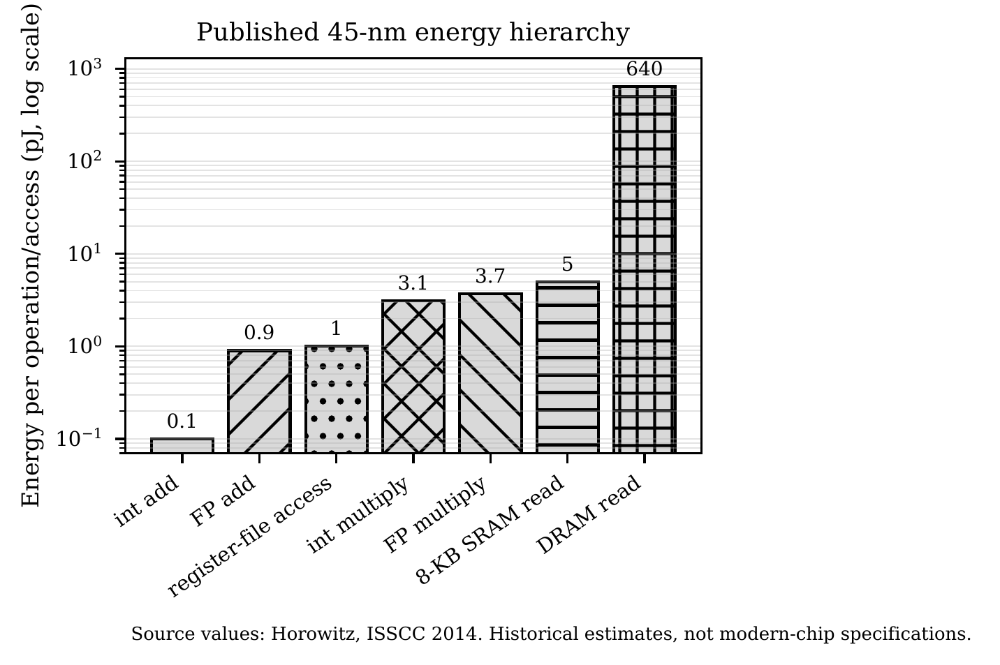

*Figure 1. Exact historical energy values replotted from \[1\]. The logarithmic axis exposes the hierarchy; absolute values change with technology. Published data, not a new measurement.*

## D. Decode Arithmetic Intensity

Consider a dense model with $P$ parameters stored at $b_w$ bytes per parameter, serving $B$ concurrent sequences. One decode step performs approximately $2PB$ FLOP—two operations per parameter per token across the batch. Weight traffic is approximately $Pb_w$ bytes and is nearly independent of $B$ because the same weights serve every sequence. Ignoring KV traffic, $$\ensuremath{\mathrm{AI}}_{\mathrm{dec,w}}\approx \frac{2PB}{Pb_w}=\frac{2B}{b_w}.$$ Equation (6)

At BF16 storage, $b_w=2$ and weight-side decode intensity is approximately the batch size in FLOP/byte. A single stream therefore operates near unity intensity; the illustrative balance point used in the analytical plots is 299 FLOP/byte. This is a stated modeling input, not a specification for every accelerator or precision mode.

Two corollaries are first-order system rules. First, batching is not merely an optional optimization; it is the mechanism that amortizes weight movement. Any technique that raises feasible live batch size—memory-efficient KV storage, prefix sharing, admission control, or longer scheduling horizons—is a throughput intervention. Second, reducing $b_w$ increases intensity and decreases traffic linearly, explaining why weight-only quantization can accelerate decode without changing the mathematical operation count.

## E. The KV-Imposed Ceiling

The weight-only result is incomplete because each sequence brings private attention state. With $K_{\mathrm{tok}}$ bytes of KV state per context token and current context $S$, per-step traffic is $$D_{\mathrm{step}}\approx Pb_w+B S K_{\mathrm{tok}}.$$ Equation (7)

The resulting parameter-FLOP/traffic proxy is $$\ensuremath{\mathrm{AI}}(B,S)=\frac{2PB}{Pb_w+B S K_{\mathrm{tok}}}.$$ Equation (8)

Unlike (6), this expression saturates as the batch grows: $$\ensuremath{\mathrm{AI}}_{\max}(S)=\lim_{B\to\infty}\ensuremath{\mathrm{AI}}(B,S)=\frac{2P}{S K_{\mathrm{tok}}}.$$ Equation (9)

Within this proxy, the longest context that can reach a selected hardware balance point $I_{bal}$ is $$S_{\max}=\frac{2P}{I_{bal}K_{\mathrm{tok}}}.$$ Equation (10)

This ceiling applies to the stated proxy, not to the full Transformer’s arithmetic intensity. The numerator omits attention-score and value-aggregation arithmetic, which grows with context; a fuller numerator includes $F_{attn}(B,S)$. The model also assumes one weight stream per iteration, independent KV reads, fixed formats, and an unchanged memory boundary. At fixed context, batching alone cannot remove the private-KV term under these assumptions. KV compression or reduced KV-head count lowers that term; prefix sharing reduces storage and prefill duplication, but shared physical pages do not automatically eliminate repeated decode reads for distinct queries. Finite accelerator capacity can prevent the batch from approaching the mathematical limit. Thus $S_{max}$ is a diagnostic threshold, not a hardware-independent impossibility result.

Fig. 2 combines three analytical views. In the running example, weight traffic per output token falls as $1/B$ and crosses the 8K-context KV term near $B\approx52$. At $B=64$, $S=8192$, intensity is approximately 28.7 FLOP/byte; the context at which KV traffic overtakes shared weight traffic is about 6.7K tokens. These values are derived from the stated assumptions, not measured.

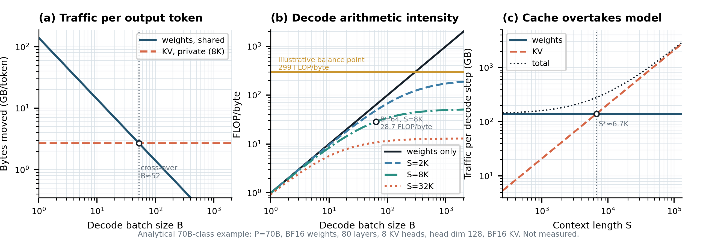

*Figure 2. Analytical decode regime map for the stated 70B-class example. (a) Weight traffic amortizes with batch; private KV traffic does not. (b) KV traffic caps the parameter-FLOP/traffic proxy as batch grows at fixed context; attention arithmetic is omitted. (c) At $B=64$, KV traffic overtakes weight traffic near $S^{\text{*}}=Pb_w/(BK_{\mathrm{tok}})\approx6.7$K tokens. Derived, not measured.*

# IV. Data Movement as the Organizing Constraint

## A. What Moves

Inference moves more than model weights. *Weights* are dense or expert parameters streamed from memory or sharded across devices and amortized by batch reuse. *Activations* are intermediate tensors whose traffic can be reduced by fusion and tiling. *KV state* is per-sequence, per-layer attention state that grows with context and is repeatedly reread. *Collective data* includes tensor-parallel reductions, pipeline transfers, expert dispatch and combine traffic, and synchronization metadata. *Control data* includes block tables, routing indices, sequence lengths, random-number state, and scheduler decisions. RL adds sampled tokens, log probabilities, masks, rewards, tool transcripts, policy identifiers, and frequently refreshed weights.

## B. Bytes per Useful Token

A practical diagnostic is bytes moved per useful token: $$\ensuremath{\mathrm{BPUT}}=\frac{B_w+B_{kv}+B_{\mathrm{act}}+B_{\mathrm{net}}+B_{\mathrm{ctl}}}{T_{\mathrm{useful}}}.$$ Equation (11)

The denominator excludes rejected speculative tokens, padding, duplicated recomputation, outputs that miss their SLO, and trajectories discarded because they are stale, invalid, or unusable. The metric can be evaluated at multiple boundaries: HBM, device interconnect, host–device, rack network, or storage.

$\mathrm{BPUT}$does not replace latency, utilization, or quality. It makes hidden waste visible. A design may save HBM bytes while increasing network bytes, reduce weight traffic while expanding KV state, or raise raw tokens/s while generating more rejected work. A generalized movement cost is $$C_{\mathrm{move}}=\sum_h \lambda_h B_h,$$ Equation (12)

where $h$ indexes hierarchy boundaries and $\lambda_h$ reflects energy, latency, congestion, or monetary cost at each boundary. Specialized hardware attempts to reduce $\lambda_h$, reduce $B_h$, or increase the useful work performed before a byte moves again.

## C. A First-Order Energy Model

For one output token in a batch of $B$, a first-order energy model is $$E_{\mathrm{tok}}\approx {} e_m\left(\frac{Pb_w}{B}+S K_{\mathrm{tok}}\right) + 2e_aP  + e_n C + E_{\mathrm{ctl}},$$ Equation (13)

where $e_m$ is memory energy per byte, $e_a$ arithmetic energy per FLOP, $e_n$ interconnect energy per byte, $C$ collective or transfer volume, and $E_{\mathrm{ctl}}$ control/launch overhead.

The model reconciles two apparently inconsistent claims. The per-operand energy gap between DRAM access and arithmetic can be $10^2$–$10^3$ or larger. The system-level gap after batching, caching, fusion, and reuse is smaller because the expensive operand movement is amortized across many operations. The distance between those ratios is precisely the value delivered by reuse. Reporting only the historical per-access ratio overstates what a well-engineered system pays; reporting only the post-reuse ratio understates the penalty when reuse collapses.

Three optimization paths follow directly: increase reuse and feasible batch size; reduce bits moved; and reduce the multiplicands themselves through sharing, compression, sparsity, or architecture changes. The rest of the paper is a catalogue of those mechanisms and their interactions.

# V. KV Cache, Paged Attention, and IO-Aware Execution

## A. Capacity and Crossover

Without a KV cache, generating token $t$ would recompute keys and values for all preceding tokens, making generation unnecessarily expensive. Caching converts repeated computation into persistent state. For $L$ layers, $n_{kv}$ key/value heads, head dimension $d_h$, element width $b_{kv}$, and sequence lengths $S_i$, $$M_{KV}=2L n_{kv} d_h b_{kv}\sum_i S_i.$$ Equation (14)

The factor of two accounts for keys and values. Per context token, $$K_{\mathrm{tok}}=2L n_{kv}d_h b_{kv}.$$ Equation (15)

Multi-query and grouped-query attention reduce $n_{kv}$ directly \[6\], \[7\]; latent-attention schemes compress the state further \[8\].

For the running example, $K_{\mathrm{tok}}=327{,}680$ bytes, approximately 320 KiB per token. An 8192-token sequence therefore occupies 2.5 GiB (2.68 GB) of KV state. At $B=64$, that is 160 GiB (171.8 GB), exceeding the 140 GB decimal footprint of 70B BF16 weights. The crossover context is $$S^{\text{*}}=\frac{Pb_w}{B K_{\mathrm{tok}}},$$ Equation (16)

which is about 6.7K tokens at $B=64$.

Fig. 3 shows how attention architecture and KV precision change per-sequence capacity. MHA at BF16 is eight times larger than the 8-head GQA example; reducing the KV representation from 16 to 8 or 2 bits shifts the context–capacity frontier proportionally.

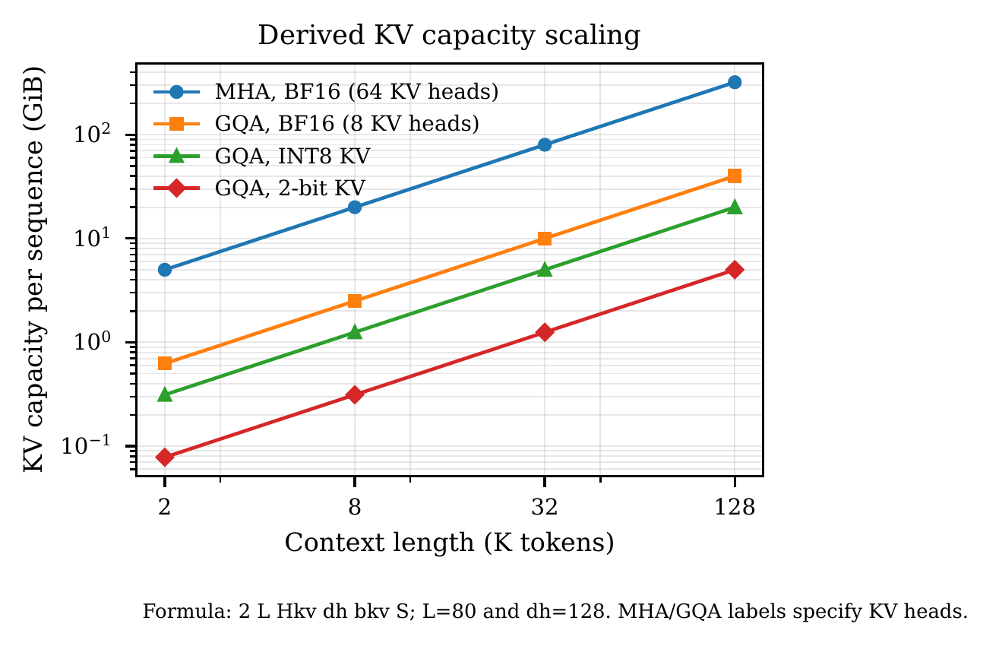

*Figure 3. Analytical KV capacity for the stated 80-layer, $d_h=128$ example under different attention and precision choices. Derived, not measured.*

## B. Paged KV Management

Contiguous reservation performs poorly because final output length is unknown at admission. Reserving the maximum wastes memory; growing contiguous buffers causes relocation or fragmentation; variable lifetimes fragment the heap; and parallel samples duplicate long prefixes. Because feasible batch size governs weight-side reuse, allocator waste can become throughput loss.

PagedAttention applies virtual-memory ideas to the KV cache \[9\]. Fixed-size logical blocks are allocated on demand from a non-contiguous physical pool, and each sequence maintains a block table. Internal waste is bounded by the unfilled tail of the final block. Prefixes can be reference-counted and shared; branches diverge through copy-on-write; eviction, migration, and tiering become block operations rather than whole-sequence operations.

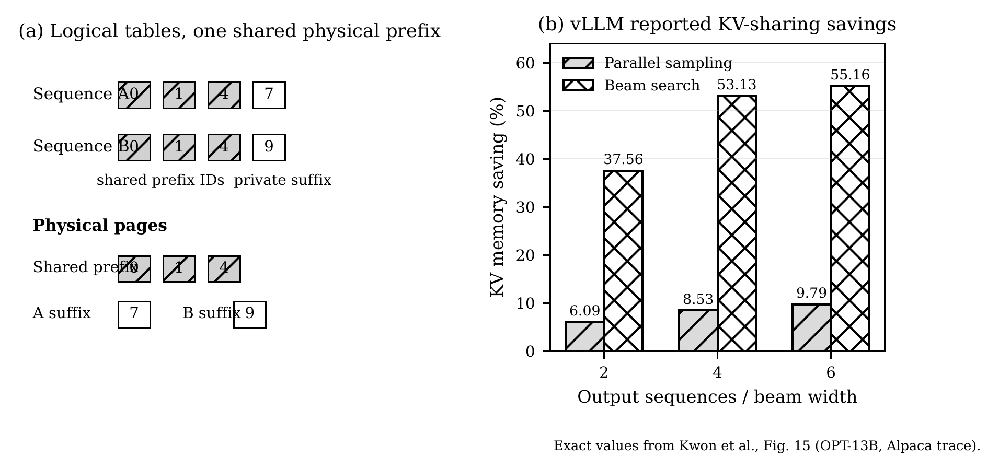

*Figure 4. Source-grounded paged-KV redraw and exact memory-sharing results from vLLM Fig. 15 \[9\]. Logical sequence order is decoupled from physical allocation; common prefixes share pages and diverge through copy-on-write. The published bars quantify memory savings for parallel sampling and beam search under the paper’s settings.*

Paging introduces indirection and can reduce burst contiguity, so block size is a co-design parameter. Small blocks reduce tail waste and migration granularity but increase metadata and lookup overhead. The trade is generally favorable because a modest kernel penalty buys a multiplicative gain in achievable concurrency.

## C. IO-Aware Attention Kernels

Materializing the $S\times S$ attention matrix in HBM incurs avoidable traffic. FlashAttention tiles the computation so scores remain in on-chip SRAM and uses online softmax normalization, producing exact attention with fewer HBM round trips \[10\]. Later generations improve work partitioning, asynchrony, and low-precision execution \[11\], \[12\]. This is the cleanest illustration of movement-centric optimization: the mathematics is unchanged, while intermediate placement changes substantially.

The kernel must consume the actual serving representation. Paged layouts, quantized KV blocks, variable lengths, and prefix sharing require attention kernels whose tile, page, quantization group, and gather strategy are co-designed. A compressed representation that requires full-precision reconstruction in HBM forfeits much of its theoretical gain.

## D. Prefix Reuse and Hierarchical Stores

Production traffic repeatedly uses system prompts, retrieved documents, few-shot examples, tool schemas, and conversation history. Prefix caching converts repeated prefill into lookup and reuse. Radix-tree scheduling generalizes this across structured programs \[13\]. Prefix locality changes routing: the nearest idle worker may be worse than a slightly busier worker already holding most of the required state.

At cluster scale, KV placement resembles a distributed storage problem with naming, ownership, replication, reference counts, eviction, and consistency. Cold blocks may move to host DRAM or NVMe; hot prefixes may be replicated; blocks may be transferred over RDMA; and computation may be placed around resident state \[14\], \[15\]. In agentic traffic, where each tool-augmented turn resubmits a growing trajectory, prefix reuse is often structural rather than optional.

# VI. Continuous Batching and Phase-Aware Scheduling

## A. Iteration-Level Admission

Static batching forms a batch and runs it until all sequences finish. Short requests wait for the longest, completed slots remain idle, and new arrivals cannot enter. Iteration-level scheduling rebuilds the active batch after each decode step: completed requests retire, new work enters, and the live batch stays dense \[16\]. This converts unpredictable output lengths into stable accelerator occupancy.

Paged allocation and continuous batching are complements. Arbitrary admission and retirement require dynamic, non-contiguous memory management; dynamic pages are most valuable when the scheduler can immediately spend them on new work. The scheduler must also protect against future KV exhaustion: maximizing the current batch can over-admit long sequences and trigger later preemption or deadlock.

## B. Chunked Prefill

A long prefill can stall every ongoing decoder if both phases share one execution queue. Prioritizing prefill improves $\mathrm{TTFT}$but creates inter-token latency spikes; prioritizing decode protects active streams but starves new requests. Chunked prefill divides a long prompt into bounded work units and interleaves them with decode tokens \[17\].

The result is more than a compromise. Decode is bandwidth-oriented and often leaves arithmetic underused; prefill is compute-oriented. Mixing them at the right granularity can overlap complementary resource demand. Chunk size controls a three-way tension: large chunks improve matrix efficiency and prompt completion; small chunks bound decode interference and improve responsiveness; excessively small chunks multiply launch, bookkeeping, and reread overhead.

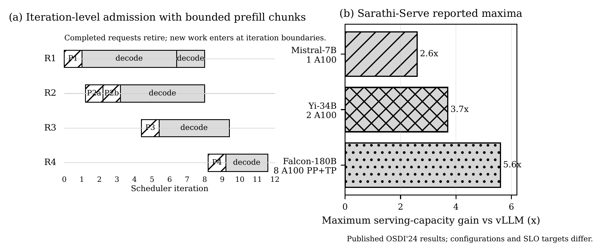

*Figure 5. Source-grounded scheduling redraw and exact Sarathi-Serve capacity results \[17\]. Panel (a) illustrates iteration-level admission and bounded prefill chunks. Panel (b) replots the three published maxima under the paper’s model/hardware/SLO settings.*

## C. Scheduling Objectives

A production scheduler is multi-objective: protect $\mathrm{TTFT}$, $\mathrm{TPOT}$, and end-to-end deadlines; maximize goodput; avoid KV oversubscription; provide fairness; preserve prefix locality; and account for adapters, speculative branches, expert placement, and policy versions. A simple urgency signal is deadline slack: $$\mathrm{Slack}_i=D_i-t_{now}-\widehat{R}_i,$$ Equation (17)

where $D_i$ is a deadline and $\widehat{R}_i$ predicted remaining service. Remaining length is uncertain, so robust admission combines online prediction, conservative memory reservation, aging, and backpressure. RL rollouts may additionally be grouped by policy version, sampling configuration, or environment affinity.

# VII. Speculative Decoding

## A. Draft, Verify, and Accept

Autoregressive generation is sequential because token $t+1$ depends on token $t$. Speculative decoding uses a cheaper draft mechanism to propose several future tokens and verifies them in parallel with the target model \[18\], \[19\]. With the correct acceptance and correction rule, the output distribution is exactly the target distribution.

The system asymmetry follows from (6). Verifying $\gamma$ positions in one target pass can read the target weights once while doing approximately $\gamma$ times the arithmetic. In a bandwidth-bound regime, much of that arithmetic fits under the memory time. If $\alpha$ is an approximate independent per-position acceptance probability, $$\mathbb{E}[A]\approx\sum_{i=0}^{\gamma}\alpha^i=\frac{1-\alpha^{\gamma+1}}{1-\alpha}.$$ Equation (18)

At $\alpha=0.8$, $\gamma=4$, the expectation is about 3.36 tokens advanced per target pass.

A more operational speed model is $$S_{spec}\approx\frac{\mathbb{E}[A]c_{T,1}}{c_{T,\gamma}+\gamma c_D+c_{\mathrm{ctl}}},$$ Equation (19)

where $c_{T,1}$ is an ordinary target step, $c_{T,\gamma}$ a verification pass, $c_D$ draft cost, and $c_{\mathrm{ctl}}$ tree, sampling, rollback, and scheduling overhead.

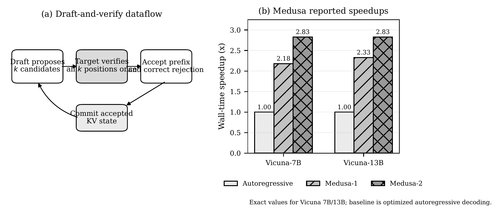

*Figure 6. Source-grounded draft-and-verify redraw and exact Medusa wall-time speedups \[20\]. The bars reproduce the reported Vicuna-7B and Vicuna-13B values relative to the optimized autoregressive baseline.*

Drafts may come from a smaller model, early-exit layers, additional prediction heads such as Medusa \[20\], feature-level autoregression such as EAGLE \[21\], retrieved continuations, or prompt n-grams. Copy-heavy workloads can obtain high acceptance from near-zero-cost prompt lookup.

## B. The Batch- and Context-Dependent Crossover

Speculation is profitable while $$\mathbb{E}[A] > \frac{c_{T,\gamma}+\gamma c_D+c_{\mathrm{ctl}}}{c_{T,1}}.$$ Equation (20)

At low concurrency, verification uses arithmetic headroom that would otherwise be idle. As the batch approaches the hardware balance point, rejected-token arithmetic ceases to be free and can displace useful work. The common rule that speculation helps at low batch and hurts at high batch is still incomplete: long-context KV traffic can keep verification bandwidth-bound even at large batch. That condition does not guarantee a speedup: draft cost, acceptance, KV rereads, expert activation, and scheduling overhead must still satisfy (20).

The correct mental model is that speculative decoding converts arithmetic headroom into latency reduction. It is naturally valuable for low-batch interactive serving, on-device generation, and agent steps on the critical path. It is less attractive for maximum-throughput offline decoding and many RL rollout fleets, where large batches already consume arithmetic capacity.

## C. System Interactions

Continuous batching becomes more complex because requests accept different numbers of tokens. Accepted tokens append to target KV state; rejected suffix state must be discarded or never committed. A smaller or more heavily quantized draft may be faster but less aligned, reducing acceptance. Under MoE, a verification tree may activate a union of many experts, eroding the assumption of one nearly constant weight stream. Acceptance length, draft cost, batch size, context, and expert count must therefore be measured together.

# VIII. Quantization as Movement Compression

## A. Why Quantization Has Multiplicative Effects

Quantization reduces memory traffic linearly with bit width and can reduce arithmetic energy super-linearly. Capacity freed by compression permits a larger live batch, which increases weight reuse; the indirect batch effect can be as important as the direct kernel speedup.

Weight-only methods such as GPTQ and AWQ reduce the $Pb_w/B$ term while keeping activations wider \[22\], \[23\]. This is well matched to low- and moderate-batch decode. Weight-and-activation methods additionally use low-precision matrix engines; activation outliers motivate mixed paths or transformations such as SmoothQuant \[24\], \[25\]. FP8 and block-scaled microscaling formats provide floating-point dynamic range with compact storage \[26\], \[27\].

KV quantization attacks both capacity and recurring reads. Keys and values exhibit different distributions; KIVI uses per-channel key quantization and per-token value quantization \[28\]. QServe demonstrates that low-bit weight, activation, and KV formats must be co-designed with the GPU runtime to convert theoretical compression into end-to-end throughput \[29\].

**Table II. Quantization Modes and Operating Regimes**

|                       |                                                                      |                                      |
|:----------------------|:---------------------------------------------------------------------|:-------------------------------------|
| Mode                  | Benefit / risk                                                       | Best fit                             |
| W8A8 / FP8            | Lower weight and activation traffic; outliers and accumulation error | Compute-heavy prefill, large batches |
| W4A16                 | Large weight compression; dequantization overhead                    | Low-to-medium decode batch           |
| W4A8                  | Weight and activation compression; kernel complexity                 | Cloud serving with fused kernels     |
| KV8                   | Approx. 2$\times$ state capacity; usually modest quality risk        | Long context and concurrency         |
| KV4 / KV2             | Further capacity and bandwidth gains; unpacking and quality tails    | KV-limited decode                    |
| Quantized collectives | Fewer network bytes; accumulated error                               | Tensor/expert parallel traffic       |

## B. The Bottleneck Moves

A fourfold storage reduction does not guarantee a fourfold speedup. Packing, scale loads, zero-point handling, dequantization, format conversion, alignment, and unsupported instruction paths can consume the saving. At high batch, a previously bandwidth-bound operator may become compute-bound. At very low precision, normalization, reductions, and softmax may dominate because they remain wider.

Quantization should therefore be selected by phase and evaluated end to end. Weight-only INT4 may transform decode while obstructing large prefill GEMMs. KV4 can increase batch capacity and indirectly improve weight reuse, yielding a second-order gain larger than the attention-kernel speedup alone. Conversely, a compressed format that fragments execution into many unfused kernels can worsen $\mathrm{TTFT}$.

## C. Quality and Numerical Contracts

The constraint is not average benchmark accuracy but a quality contract: perplexity, task accuracy, calibration, rare-token behavior, tool-call syntax, long-context retrieval, safety-filter behavior, and sampling stability. Compression often degrades the tails of capability—long-horizon reasoning, rare languages, exact retrieval, and agent reliability—before it changes the mean.

Mixed precision is generally more valuable than uniform minimum precision. Sensitive layers, outlier channels, embeddings, logits, normalization, routing, and a recent KV window may remain wider. A useful operating-point formulation is $$q^{\text{*}}=\arg\max_q \frac{\ensuremath{\mathrm{Goodput}}(q)}{\overline{P}_{\mathrm{elec}}(q)}\quad\mathrm{s.t.}\quad \Delta Q(q)\leq\epsilon.$$ Equation (21)

Here $\overline{P}_{\mathrm{elec}}$ is mean electrical power over the same observation interval as goodput. Requests per second divided by joules per second gives compliant requests per joule; dividing a rate by total energy would not have that unit.

Fig. 7 reproduces exact reported factors from KIVI and DistServe. The two panels deliberately retain their original, different metrics.

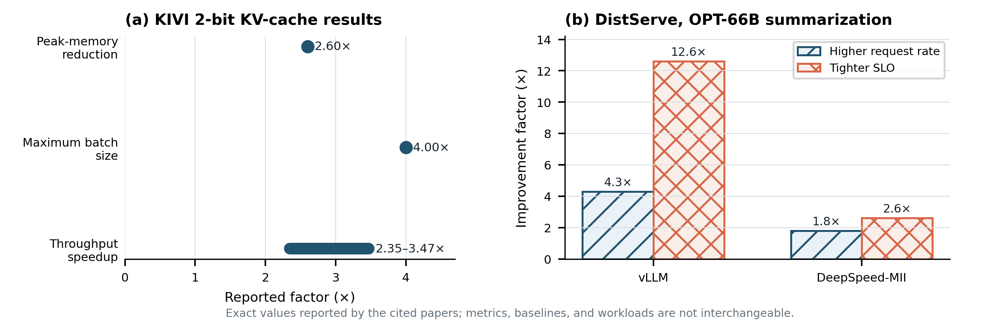

*Figure 7. Exact published values. (a) KIVI reports 2.6$\times$ lower peak memory, support for up to 4$\times$ larger batch, and 2.35–3.47$\times$ throughput improvement under its evaluated workloads \[28\]. (b) DistServe’s OPT-66B summarization case reports request-rate and SLO improvements relative to vLLM and DeepSpeed-MII \[30\]. The metrics are not directly comparable across panels.*

# IX. Prefill/Decode Disaggregation

## A. Motivation and Transfer Cost

Colocating prefill and decode preserves local KV state but couples phases with different resource profiles. Long prefills interfere with token cadence; one parallelism plan must serve both phases; and independent scaling is impossible. DistServe and Splitwise show that separating the phases can improve goodput, cost, or power by assigning each to a better-suited pool \[30\], \[31\].

Prefill workers favor arithmetic throughput and prompt-level parallelism. Decode workers favor bandwidth, capacity, replication, and large continuous batches. Disaggregation introduces a new cost: the prompt KV state must move to the decode worker. A first-order visible transfer time is $$T_{KV}^{vis}\approx \max\!\left(0,\frac{M_{KV,prompt}}{\beta_{pd}}-T_{ovlp}\right)+T_{setup}+T_{queue,net},$$ Equation (22)

where $\beta_{pd}$ is effective end-to-end bandwidth and $T_{ovlp}$ the layer-wise portion hidden behind the tail of prefill.

The decision is a queueing-and-transport trade-off. Disaggregate when isolation, phase-specific parallelism, and independent provisioning exceed the transfer penalty and duplicated weight capacity. The transfer can be favorable because it is a one-time, bulk, sequential movement traded against recurring scheduler interference and random-access KV traffic.

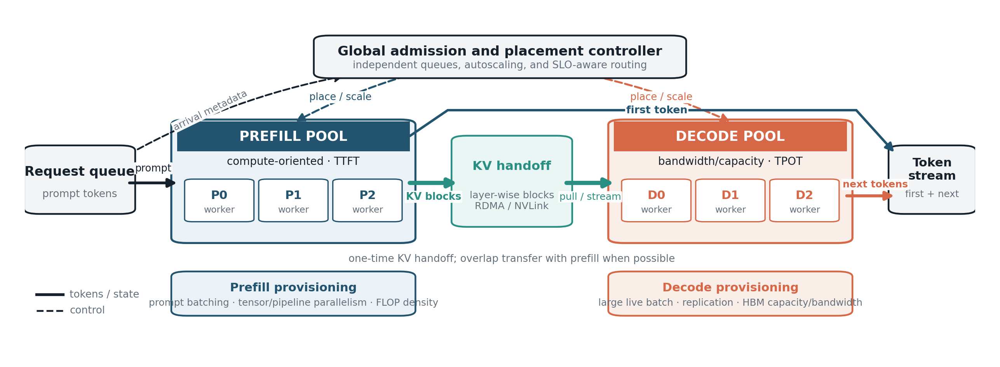

*Figure 8. Source-grounded explanatory redraw of prefill/decode disaggregation. A global controller maintains independent queues and placement decisions; prompt KV blocks are handed off once, preferably layer-wise and overlapped. This is a conceptual architecture, not a measured cluster topology.*

## B. Benefits, Failure Modes, and Hybrid Designs

Benefits include independent scaling by prompt-token and generated-token demand, phase-specific tensor/pipeline/replica choices, SLO isolation, heterogeneous hardware, and separate fault/upgrade domains. Failure modes are equally concrete. KV transfer can dominate short outputs; model replication increases capacity requirements; advertised link bandwidth may not equal end-to-end transfer bandwidth; receivers can become hot spots; retries need ownership rules for partially transferred pages; and layout or precision mismatch may force conversion on the critical path.

Full separation is not always optimal. A service can colocate phases within a fast scale-up domain, disaggregate only overflow, or keep short prompts local while exporting long prompts. The decision may be made per request from predicted output length, prompt KV size, queue state, cache locality, and network congestion. KV-centric systems extend the hierarchy across HBM, CPU memory, storage, and RDMA so computation is scheduled around the state already resident \[15\].

# X. The Service Frontier: TTFT Versus Throughput

## A. Why the Objectives Conflict

Throughput improves when more requests share each weight load and large matrices use the accelerator efficiently. $\mathrm{TTFT}$improves when a request starts immediately. Waiting builds a larger batch but adds queueing. $\mathrm{TPOT}$adds a third constraint: a long prefill, oversized verification tree, or congested collective can improve aggregate efficiency while delaying the next token of every active sequence.

The correct output of an inference benchmark is therefore a Pareto frontier, not a single maximum-throughput point. Each point corresponds to a concurrency cap, batching window, token budget, prefill chunk size, parallelism plan, precision, speculation depth, and possibly a different hardware pool.

A useful decomposition is $$\ensuremath{\mathrm{TTFT}}= t_{adm}+t_{queue}+t_{prefill}+t_{xfer},$$ Equation (23)

$$\ensuremath{\mathrm{TPOT}}_i = t_{kernel,i}+t_{sched,i}+t_{intf,i}+t_{sync,i}+t_{net,i}.$$ Equation (24)

The second line is a per-iteration critical-path accounting approximation, not an identity for the sum of component percentiles. The p99 is computed from the joint observed latency distribution. Optimizing kernel time alone can be misleading. A speedup may cause the scheduler to admit more work, leaving tail $\mathrm{TTFT}$unchanged. Conversely, a strict concurrency cap can improve p99 while wasting capacity during benign periods.

## B. Workload Classes Want Different Stacks

**Table III. Workload-Specific Serving Priorities**

|                     |                                           |                                                                                     |
|:--------------------|:------------------------------------------|:------------------------------------------------------------------------------------|
| Workload            | Dominant objective                        | Typical stack                                                                       |
| Interactive chat    | $\mathrm{TTFT}$and readable token cadence | Moderate batch, chunked prefill, prefix cache, adaptive speculation                 |
| Long-form reasoning | End-to-end decode latency                 | Decode-optimized pool, KV compression, speculation where arithmetic headroom exists |
| Agentic workflow    | Critical-path latency across many calls   | Prefix reuse, stateful scheduling, resumable KV, priority by workflow slack         |
| Offline batch       | Cost/token and throughput                 | Maximum safe batch, aggressive quantization, little or no speculation               |
| RL rollouts         | Useful trajectories/accelerator-hour      | Large batch, versioned state, environment overlap, policy refresh discipline        |

Cost-normalized metrics include SLO-compliant tokens per joule, requests per dollar-hour, and useful trajectories per accelerator-hour: $$\eta_{SLO}=\frac{T_{\mathrm{useful,SLO}}}{E}.$$ Equation (25)

Capacity planning must use real prompt/output distributions, burstiness, prefix reuse, and tenant mix. Fixed-length synthetic tests characterize kernels but hide allocator fragmentation, queueing, long tails, and cache locality.

# XI. Serving Sparse Mixture-of-Experts Models

## A. Sparse Arithmetic Does Not Mean Sparse System Cost

An MoE layer contains many feed-forward experts and a router selecting a small top-$k$ subset per token \[32\], \[33\], \[34\]. Only selected experts perform arithmetic, allowing total parameters to grow faster than active compute. At serving time, inactive parameters still require capacity somewhere; selected experts may reside on other devices; and routing induces all-to-all communication.

With one token in flight, only $k$ experts are read. With a large batch, routing entropy causes many or all experts to be touched, but each expert read is amortized over more routed tokens. The number of distinct experts eventually saturates while tokens per expert keep growing. Larger expert microbatches can therefore improve reuse, but their slope and crossover are routing- and model-dependent rather than universally better than those of a dense model. Small expert microbatches can suffer from poor matrix efficiency and imbalance.

## B. Communication and Imbalance

For $T$ routed tokens in one layer, hidden width $d$, activation width $b_a$, and top-$k$ routing, an uncompressed logical dispatch-plus-combine payload model is $$B_{MoE,layer}\approx 2Tkd b_a.$$ Equation (26)

This is not a lower bound on network traffic: routes to local experts need not cross the measured network boundary. For a remote-route fraction $f$, $2fTkd b_a$ is a first-order remote payload estimate. Padding, metadata, duplicated transfers, topology, compression, and staging change the observed byte count. More importantly, the slowest expert or link determines layer completion. Average bandwidth is therefore less informative than the load distribution and critical path.

Mitigations include training-time load-balancing objectives, capacity factors, replication of hot experts, topology-aware placement, token regrouping, asynchronous expert parallelism, work stealing, expert quantization, and phase-aware prefetch \[35\], \[36\], \[37\]. SwiftEP targets redundant copies and underused scale-up links through buffer fusion and TMA offload \[38\].

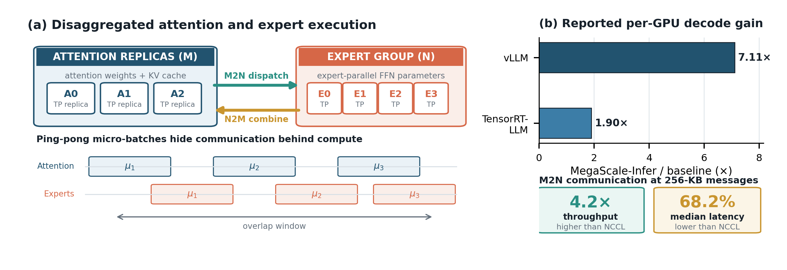

*Figure 9. Source-grounded MoE architecture and exact MegaScale-Infer results \[39\]. The reported per-GPU decode gains and 256-KB M2N communication metrics retain their original baselines and units. The architecture panel is an explanatory redraw.*

MoE composes awkwardly with several other techniques. Speculative verification may activate a superset of experts. Activation-aware quantization can poorly calibrate rarely used experts. Attention often prefers tensor parallelism while the expert block prefers expert parallelism, forcing a layout transition within every layer. Phase specialization becomes especially valuable because prefill provides many tokens to group by expert, while decode has small, latency-sensitive expert microbatches.

# XII. Inference and Reinforcement Learning

## A. Rollouts Are Inference

In RLHF, RLAIF, verifiable-reward RL, process-supervised RL, and agent training, the policy generates trajectories that are scored and used for optimization \[40\]. For $B_p$ prompts per update, $K$ samples per prompt, and mean generated length $\mathbb{E}[L_{\mathrm{out}}]$, $$N_{rollout}\approx B_pK\,\mathbb{E}[L_{\mathrm{out}}].$$ Equation (27)

Generation can consume a substantial fraction of a step’s wall-clock time, especially for long reasoning traces and tool-using environments. HybridFlow and OpenRLHF expose the system as a distributed dataflow whose generation and training components require different sharding and orchestration \[41\], \[42\].

The objective differs from interactive serving. There is often no user-facing $\mathrm{TTFT}$SLO, so batch can be pushed toward the memory limit. Prefix sharing is highly valuable because multiple samples share the same prompt. Speculation is often less attractive because the fleet already runs at high concurrency. The metric is not raw tokens/s but useful, policy-consistent trajectories per accelerator-hour and per joule.

## B. Long Tails, Environments, and Backpressure

Rollout lengths are long-tailed, and a synchronous update cannot begin until the slowest trajectory completes. Naive execution leaves accelerator time waiting on a small number of long samples. Mitigations include asynchronous generation, resumable partial rollouts, over-provisioning with carefully corrected selection, and a trajectory buffer that decouples generation from optimization.

Agentic trajectories interleave generation with tool or environment steps that can take milliseconds to seconds. Efficient systems overlap many trajectories across these gaps and retain each trajectory’s KV state or pay to recompute it. Backpressure should be based on usable trajectory inventory, policy freshness, and curriculum demand rather than raw queue length.

## C. Policy Refresh and Layout Movement

A colocated system time-shares devices between rollout and training, avoiding a dedicated idle pool but paying for optimizer-state movement and phase transitions. A disaggregated system overlaps the phases but must repeatedly transfer actor weights—tens to hundreds of gigabytes for large models—from training ranks to inference ranks. Training and inference commonly use different sharding layouts, so the transfer includes resharding.

Every trajectory should carry a policy identifier, tokenizer version, sampling configuration, environment version, rollout log probabilities, and resumable state. The learner can then reject stale data, apply off-policy correction, or bound maximum policy lag.

## D. Training–Inference Numerical Divergence

There is a correctness hazard when the rollout engine’s realized behavior distribution differs from the distribution assumed by the learning objective. Let $\pi_\theta$ denote the policy being optimized and $\pi_{\mathrm{gen}}$ the actual behavior distribution, including the policy version and sampling transformations. Where importance weighting is used, the token-level ratio is $$r_t=\frac{\pi_\theta(a_t\mid s_t)}{\pi_{\mathrm{gen}}(a_t\mid s_t)}.$$ Equation (28)

An old behavior policy is not automatically a defect: many optimization procedures deliberately reuse samples across updates. The defect is using an incorrect denominator or exceeding the algorithm’s permitted policy lag. Quantized weights, different kernels or reduction orders, approximate speculation, and inconsistent temperature or token filtering can change the realized distribution. A different random seed alone changes the sample, not necessarily its distribution.

Mitigations include recording behavior log probabilities from the generation path, preserving version and sampling metadata, applying the algorithm’s correction and clipping rules, bounding lag, and testing numerical agreement. Distribution-preserving speculation is compatible in principle, but precision, acceptance/correction code, and version activation still require validation. These are correctness requirements, not merely text-quality preferences.

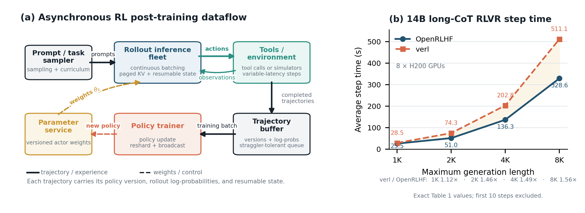

*Figure 10. Source-grounded asynchronous RL post-training dataflow and exact OpenRLHF 14B long-CoT step times \[42\]. Each trajectory carries policy version and log-probability metadata; tools and environments introduce variable gaps; the parameter service redistributes new actor weights. The plot reproduces the stated Table 1 values.*

The appropriate system metric is $$\eta_{RL}=\frac{N_{\mathrm{useful\ trajectories}}}{E}\quad\mathrm{s.t.}\quad \mathrm{lag}\leq\ell_{max},\;\Delta Q\leq\epsilon.$$ Equation (29)

It penalizes stale rollouts, invalid tool executions, rejected speculative work, and samples that miss a curriculum or environment deadline.

# XIII. Inference as the Substrate of Self-Improvement

## A. From Rollouts to Nested Inference

The distinction between bounded self-refinement and open-ended recursive self-improvement concerns what may change and how improvement is judged. The reviewed survey separately considers deployment behavior, trained policies, evaluators, and research processes, with varying degrees of human involvement \[2\]. Its verification hierarchy orders formal checks, execution feedback, learned judges, and intrinsic self-assessment as a qualitative pattern rather than a measured universal law. This paper adopts the bounded, externally evaluated setting for its accounting; it does not assume that closing a loop guarantees convergence.

Concrete systems illustrate different loops. Self-Refine generates feedback and revisions with a language model without updating its weights \[43\]. STaR generates rationales, selects those associated with correct answers, and fine-tunes through repeated rounds \[44\]. FunSearch couples program generation to execution-based evaluation and a database of candidate programs \[45\]. These mechanisms should not be conflated with one another or with open-ended recursive improvement. Their common systems demand is repeated model execution plus the work that evaluates, stores, and selects its outputs.

The following equations are *proposed accounting extensions in this paper*. They are not measurements or established metrics reported by the reviewed survey. Their purpose is to expose resource consumption that token-generation throughput alone omits.

## B. Generation and Evaluation Demand

For round $r$, let $K_r$ be the candidate count, $J_r$ the number of model-based evaluations per candidate, $L_r^g$ the mean generated candidate length, and $L_r^e$ the mean generated evaluation length. Logical decode demand is $$N_{\mathrm{dec}}\approx\sum_{r=1}^{R}K_r\left(L_r^g+J_rL_r^e\right)+N_{\mathrm{dec}}^{\mathrm{extra}}.$$ Equation (30)

Let $P_r^g$ denote generator prompt length and $P_r^e$ evaluator instructions and context excluding the candidate. When each evaluator reads the candidate once, logical prompt demand is $$N_{\mathrm{prompt}}\approx{}\sum_{r=1}^{R}K_r\left[P_r^g+J_r(P_r^e+L_r^g)\right] +N_{\mathrm{prompt}}^{\mathrm{extra}}.$$ Equation (31)

The extra terms include repairs and meta-evaluations only when not already counted in the round terms. A scoring model can have $L_r^e=0$ while still incurring a substantial forward pass over its input. Conversely, a tool-based checker may add no language-model tokens while consuming substantial CPU, accelerator, storage, or simulator resources.

These equations count logical tokens, not FLOPs, cache misses, or energy. Cache hits reduce executed prefill work but not logical prompt demand. Different generator and judge models require separate per-model accounting; the simplified sum assumes a common tokenization convention. Measured prefill and decode costs must be applied separately rather than pricing every token identically. Candidate length, evaluation multiplicity, and repair probability are often correlated, so products of averages are an approximation to trace-level sums.

## C. Verification Is a Resource and a Contract

Table IV interprets evaluation mechanisms as systems workloads. It is an author synthesis, not an experimentally measured ranking. Reliability is relative to the specification, test distribution, and independence of the evidence; there is no single scalar ordering that simultaneously captures reliability, coverage, latency, and cost.

**Table IV. Evaluation Mechanisms: Author Systems Interpretation, Not a Measured Ranking**

|                           |                                                                                                                   |                                                                            |                                                                                         |
|:--------------------------|:------------------------------------------------------------------------------------------------------------------|:---------------------------------------------------------------------------|:----------------------------------------------------------------------------------------|
| Mechanism                 | What the signal establishes                                                                                       | Resource demand                                                            | Required accounting or control                                                          |
| Formal checker            | Validity relative to a formal specification; does not establish that the specification captures the intended goal | Checking compute and memory; cost is problem-dependent                     | Pin specification and checker version; retain the checkable artifact                    |
| Execution feedback        | Performance on executed tests or environments; coverage can be incomplete                                         | Compilation, CPU/GPU execution, simulator time, I/O                        | Record tests, seeds, timeouts, failures, and held-out checks                            |
| Learned judge             | A model’s assessment under a rubric; may share blind spots with the generator                                     | Additional model prefill, possible decode, weights and KV state            | Record judge version, rubric, sampling and calibration; audit independently             |
| Intrinsic self-assessment | The generator’s confidence or consistency, not independent evidence of correctness                                | Small score extraction or multiple samples for consistency                 | Treat as a screening signal; count repeated samples and avoid self-certified acceptance |
| Human audit               | Domain assessment subject to human expertise and variability                                                      | Review time and workflow delay, tracked separately from accelerator energy | Record criteria and disagreement; avoid implying unlimited reliability                  |

An evaluation cascade can screen cheaply before escalating uncertain or high-impact candidates to stronger checks. This is a proposed provisioning policy, not a guaranteed improvement algorithm. The acceptance criterion should be fixed before comparison and should not be replaced silently by the generator’s own confidence. Changing the evaluator, tests, or rubric defines a new evaluation condition and must be reported as such.

## D. From Useful Tokens to Verified Improvement

Let $N_{\mathrm{imp}}$ count distinct improvements that pass a declared external acceptance protocol against a fixed baseline. Passing a test is not necessarily an improvement, and duplicate passing artifacts must not inflate this count. For bytes $D_h$ observed at hierarchy boundary $h$, define $$\mathrm{BPVI}_h=\frac{D_h}{N_{\mathrm{imp}}},\qquad N_{\mathrm{imp}}>0.$$ Equation (32)

The unit is bytes per verified improvement at the stated boundary. A separate weighted movement cost is $$C_{\mathrm{move,imp}}=\frac{\sum_h\lambda_hD_h}{N_{\mathrm{imp}}},\qquad N_{\mathrm{imp}}>0.$$ Equation (33)

If $\lambda_h$ has units of joules per byte, the result has units of joules per improvement; it must not be labeled as a byte count. Boundaries may count the same datum more than once as it moves through the hierarchy, so their physical meaning must be stated.

Counting accepted changes also ignores their magnitude. For a higher-is-better external quality measure $Q_{\mathrm{ext}}$, a complementary campaign-level metric is $$\eta_{\mathrm{imp}}=\frac{\Delta Q_{\mathrm{ext}}}
{E_{\mathrm{gen}}+E_{\mathrm{eval}}+E_{\mathrm{tools}}+E_{\mathrm{train}}+E_{\mathrm{sync}}}.$$ Equation (34)

All energies cover the same campaign with mutually exclusive accounting categories; failed candidates and retries remain in the denominator. Synchronization energy must not be counted again inside another category. Report the baseline, evaluation set, uncertainty, and any omitted host or facility energy. A zero or negative quality change remains zero or negative. When $N_{\mathrm{imp}}=0$, BPVI is undefined and should be reported with total expended resources, not as zero. Different quality scales and acceptance protocols are not a common leaderboard. “Verified” is explicitly scoped to the protocol, not a claim of universal correctness or novelty.

## E. Serving and Measurement Consequences

Generator, learned-judge, and tool pools can have different prompt/decode ratios and latency distributions. Judge capacity should be provisioned from evaluation demand rather than as a fixed fraction of generator capacity. Backpressure should track candidates awaiting credible evaluation; otherwise a faster generator can produce an expanding queue of unusable or stale artifacts. Where models differ, their weights and KV states remain separate; shared strings alone do not permit cross-model KV reuse.

Each candidate record should include its artifact hash, generator and evaluator versions, parent candidate, rubric or test identifier, sampling configuration, resource usage, and acceptance outcome. Keep development feedback separate from a held-out audit that is not repeatedly optimized against. Archive failures and non-improving rounds as well as successes. These proposed controls connect movement efficiency to evidence quality without claiming that more inference necessarily produces more learning. An empirical validation would compare fixed-budget campaigns under unchanged external criteria, measuring both resource use and quality with repeated runs.

# XIV. Published Experimental Evidence

Table V collects representative primary-paper measurements used in the manuscript. Each row retains the original metric and comparison. The table is intentionally not sorted by speedup.

**Table V. Representative Published Evidence and Its Proper Interpretation**

|                        |                                  |                                                      |                                                                                                                                                 |                                                                             |
|:-----------------------|:---------------------------------|:-----------------------------------------------------|:------------------------------------------------------------------------------------------------------------------------------------------------|:----------------------------------------------------------------------------|
| System                 | Mechanism                        | Workload / hardware context                          | Reported result used here                                                                                                                       | Interpretation boundary                                                     |
| vLLM \[9\]             | Paged KV, prefix sharing         | Parallel sampling and beam-search experiments        | 6.09–9.79% and 37.56–55.16% memory savings in reproduced points                                                                                 | Memory sharing, not a universal throughput factor                           |
| Sarathi-Serve \[17\]   | Chunked prefill                  | Mistral-7B/1 A100; Yi-34B/2 A100; Falcon-180B/8 A100 | 2.6$\times$, 3.7$\times$, 5.6$\times$ serving-capacity maxima under paper SLOs                                                                  | Model, parallelism, and tail-latency constraints differ                     |
| Medusa \[20\]          | Multi-head speculation           | Vicuna-7B and 13B                                    | 2.18–2.83$\times$ wall-time speedup in reproduced results                                                                                       | Depends on acceptance, task, batch, and head training                       |
| KIVI \[28\]            | 2-bit asymmetric KV              | Llama, Falcon, Mistral evaluations                   | 2.6$\times$ lower peak memory; up to 4$\times$ batch; 2.35–3.47$\times$ throughput                                                              | Quality and kernel support must be revalidated                              |
| DistServe \[30\]       | P/D disaggregation               | OPT-66B summarization case                           | vs vLLM: 4.3$\times$ request rate, 12.6$\times$ tighter SLO; vs MII: 1.8$\times$, 2.6$\times$                                                   | Goodput and SLO comparisons, not raw token throughput                       |
| MegaScale-Infer \[39\] | Disaggregated expert parallelism | Large-scale MoE serving                              | 7.11$\times$ and 1.90$\times$ per-GPU decode gains vs stated baselines; M2N 4.2$\times$ throughput and 68.2% median-latency reduction at 256 KB | Decode and communication metrics use different units                        |
| OpenRLHF \[42\]        | RL rollout orchestration         | 14B long-CoT RLVR, 8 H200 GPUs                       | 25.5/51.0/136.3/328.6 s at 1K/2K/4K/8K, lower than reproduced verl times                                                                        | Step-time result includes framework and workload assumptions                |
| NanoFlow \[46\]        | Intra-device overlap             | Multiple dense and MoE models                        | 1.91$\times$ throughput boost and 50–72% of modeled optimum in reported evaluation                                                              | Demonstrates that end-to-end serving can become compute-bound after overlap |

Several conclusions are robust even though the numerical factors are not portable. Memory allocation and scheduling can change feasible batch enough to produce multi-fold gains. Tail-latency-aware capacity is more meaningful than unconstrained token throughput. Low-precision weights and KV state have multiplicative effects through traffic and residency. Disaggregation is valuable only when one-time transfer is cheaper than repeated interference. MoE and RL make network and orchestration costs first-class even though they are invisible in a FLOP count.

# XV. Specialized Inference Hardware

Software can raise reuse, compress state, and overlap resources, but it cannot eliminate the energy cost of distance. Hardware specialization should therefore target the movement pattern of inference rather than simply add more matrix throughput.

## A. Locality and Compressed Data Paths

Frequently reused data should remain near arithmetic. Large software-managed SRAM, register-rich tiles, stacked memory, and near-memory attention can reduce HBM traffic. For KV state—high volume, low reuse, and regular append/gather behavior—near-memory execution is especially attractive. The compressed representation should remain compressed from storage through the hierarchy and expand only adjacent to the consumer. Decompressing at the memory controller captures less of the movement saving.

## B. Native Low Precision

A complete low-precision path includes scale loads, zero points, outlier lanes, mixed-precision accumulation, normalization, softmax, logits, and conversion. A nominal INT4 or FP4 multiplier is insufficient if tensors are transported or materialized at 16 bits. Precision should be programmable by tensor, layer, channel group, KV age, phase, or request tier. Extremely low-bit training-aware representations may eventually replace multiplier arrays with addition-dominated datapaths \[47\].

## C. KV and Collective Operations as First-Class Primitives

Generic tensor loads hide semantic opportunities. Future runtimes or instruction sets should expose block-level KV append, gather, prefix compare, reference count, copy-on-write, migration, and quantization. MoE requires high-radix all-to-all, multicast, reduction, scatter/gather, and independent movement engines. P/D disaggregation requires topology-aware KV streaming. RL requires weight broadcast and resharding. In all three cases, communication engines can improve tokens per joule more than additional arithmetic units when movement is binding.

## D. Phase-Specific Operating Points

Prefill and decode can justify different chips or heterogeneous chiplets. A prefill engine favors dense arithmetic and moderate capacity; a decode engine favors bandwidth, capacity, efficient GEMV, paged gathers, and attention-specific state operations. Separate devices are attractive at sufficient scale and interconnect quality; shared silicon is attractive for small or bursty deployments. A near-term compromise is configurable operating points: partitionable arrays, independently clocked memory and movement engines, flexible precision, and runtime-controlled SRAM allocation.

**Table VI. Hardware Design Priorities for Inference**

|                   |                                                            |                                                |
|:------------------|:-----------------------------------------------------------|:-----------------------------------------------|
| Priority          | Architectural implication                                  | Effect                                         |
| Locality          | Large managed SRAM; register-rich tiles; stacking          | Fewer long-distance trips                      |
| Low precision     | Native INT8/INT4/FP8/FP4; block scales; mixed accumulation | Fewer bits and no conversion bottleneck        |
| KV semantics      | Paged gather/append; copy-on-write; prefix compare         | Lower attention and allocator overhead         |
| Movement engines  | Async DMA; gather/scatter; multicast; reduction            | Overlap communication and free general cores   |
| MoE fabric        | High-radix, topology-aware all-to-all                      | Lower dispatch latency and imbalance penalty   |
| Phase flexibility | Distinct compute/bandwidth operating points                | Better energy matching and independent scaling |
| Observability     | Per-engine bandwidth, stall, and energy counters           | Lets schedulers optimize the real bottleneck   |

Accelerator evaluation should therefore report useful tokens per joule at stated batch, context, SLO, and quality, not peak FLOP/s alone \[48\], \[49\], \[50\].

# XVI. Reference Architecture and Measurement Methodology

## A. State Placement as the Organizing Abstraction

Fig. 11 presents a reference platform whose central abstraction is state placement rather than request routing. The decomposition does not require every deployment to fully disaggregate; components can be colocated when locality is more valuable than separation.

An ingress classifier extracts model, adapter, prompt length, expected output class, latency tier, sampling mode, and policy version. A global scheduler enforces memory-safe concurrency and SLO-aware backpressure. A KV directory tracks token-prefix identity, ownership, precision, tier, reference count, and transfer state. The prefill pool optimizes prompt batches and first-token latency; the decode pool optimizes continuous batching and KV reads. A speculation service selects draft source and depth. An MoE controller places and replicates experts. An RL coordinator manages policy versions, environment sessions, and trajectory metadata. Observability closes the loop with measured bytes, stalls, tails, goodput, and energy.

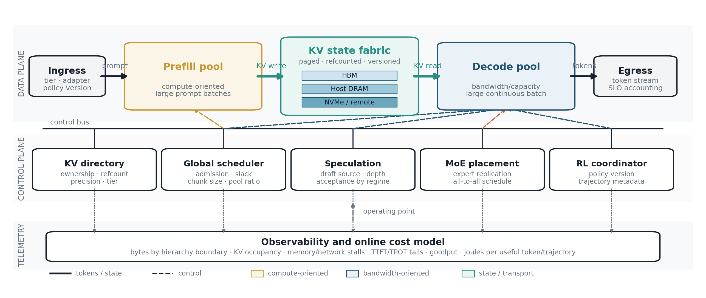

*Figure 11. Author-created explanatory reference architecture. Solid paths carry tokens or state; dashed paths carry control. Prefill is compute-oriented, decode bandwidth-oriented, and the KV fabric spans multiple memory tiers. This is a design synthesis, not a measured production topology.*

## B. Feedback Control

The scheduler should behave as a multi-timescale feedback controller. It observes queue lengths, token arrival rates, KV occupancy, memory bandwidth, compute utilization, interconnect congestion, expert imbalance, speculation acceptance, policy lag, and SLO violations. It adjusts concurrency caps, chunk size, decode token budget, pool ratio, precision, routing, and replication.

Static tuning is inadequate because trace distributions and model versions change. The controller must also avoid oscillation: rapidly shifting capacity between prefill and decode can create alternating queue buildup. Microsecond decisions form batches; millisecond decisions route work; second-scale decisions change pool allocations; minute-scale decisions autoscale nodes and migrate hot prefixes. Hysteresis, dwell times, and predictive control are useful.

## C. Isolation and Security

KV sharing introduces isolation requirements. Shared pages must be keyed by model, tokenizer, exact token sequence, adapter, precision, and security domain. Reference counts and copy-on-write must prevent cross-tenant corruption. Timing and occupancy can become side channels, motivating partitioned caches or disabled cross-domain reuse for sensitive deployments. RL trajectories can contain private prompts, tool outputs, environment state, and reward signals and should follow the same governance as training data.

## D. Measurement Discipline

Optimization begins with traces, not isolated kernels. Measure prompt and output lengths, arrival burstiness, tenant mix, prefix repetition, sampling settings, adapter popularity, tool-call frequency, and correlations among them. For each phase, attribute time and bytes to weights, KV state, activations, collectives, host transfers, and control overhead. Hardware counters should distinguish compute-active time, memory stalls, network stalls, launch gaps, and synchronization.

Useful experiments hold one dimension constant while sweeping another: batch at fixed context, context at fixed concurrency, quantization at fixed quality, chunk size at fixed p99 $\mathrm{TPOT}$, or speculation depth at fixed workload class. When a curve changes slope, the bottleneck has moved. Identifying the new binding resource is the substantive result.

For self-improvement campaigns, additionally report generator and evaluator token counts separately, executed prefill versus prefix-cache hits, checking and repair cost, accepted and rejected candidates, evaluator versions, independent audit outcomes, and the quality change under a fixed external protocol. Equations (32)–(34) require a common measurement horizon and explicit boundaries; they are not validated substitutes for end-to-end task evaluation.

A reproducible report should include model architecture, active parameters, attention type, KV heads, precision, context limit, parallelism, hardware model, memory and interconnect, software versions, power method, prompt/output distributions, arrival process, prefix reuse, sampling settings, $\mathrm{TTFT}$/$\mathrm{TPOT}$/E2E at p50/p95/p99, request and token throughput, SLO goodput, KV occupancy and fragmentation, cache hit rate, bytes at each boundary, speculative acceptance and rejected work, MoE expert-load distribution and all-to-all bytes, and for RL, policy lag, environment time, weight-refresh cost, and precision differences between rollout and training paths.

# XVII. Joint Configuration, Research Agenda, and Design Rules

The inference stack is not a collection of independent toggles. Table VII maps techniques to the principal model term they change.

**Table VII. How Major Techniques Act on the Movement-Aware Cost Model**

|                          |                                           |                                                  |                                                        |
|:-------------------------|:------------------------------------------|:-------------------------------------------------|:-------------------------------------------------------|
| Technique                | Primary mechanism                         | Dominant effect                                  | Important interaction or failure mode                  |
| MQA/GQA/latent attention | Fewer or compressed KV channels           | $K_{\mathrm{tok}}\downarrow$                     | Model-quality and training-compatibility trade-offs    |
| Paged KV                 | Remove fragmentation; share pages         | Feasible $B\uparrow$, duplicated KV$\downarrow$  | Indirection and metadata overhead                      |
| Continuous batching      | Replace completed sequences immediately   | Sustained $B\uparrow$                            | Fairness, admission errors, future KV pressure         |
| Chunked prefill          | Bound prompt work per iteration           | Interference and p99 $\mathrm{TPOT}$$\downarrow$ | Too-small chunks add launch overhead                   |
| Speculation              | Several tokens per target read            | Weight reads/token$\downarrow$                   | Competes with high-batch arithmetic; MoE expert union  |
| Weight quantization      | Fewer bytes per parameter                 | $b_w\downarrow$, feasible $B\uparrow$            | Dequantization, quality tails, limited prefill benefit |
| KV quantization          | Fewer bytes per cached token              | $b_{kv}\downarrow$                               | Long-context retrieval and reasoning sensitivity       |
| P/D disaggregation       | Phase-specific resources and queues       | Interference$\downarrow$                         | One-time KV network movement and duplicated weights    |
| MoE                      | Fewer active parameters                   | Arithmetic$\downarrow$                           | Capacity, imbalance, and all-to-all$\uparrow$          |
| RL orchestration         | Overlap generation, environment, training | Useful trajectories/s$\uparrow$                  | Staleness, resharding, numerical mismatch              |

A practical controller can optimize $$\max_{\mathbf{x}}\quad  \frac{\ensuremath{\mathrm{Goodput}}(\mathbf{x})}{\overline{P}_{\mathrm{elec}}(\mathbf{x})}$$

Equation (35)

$$\mathrm{s.t.}\quad  \Pr(\ensuremath{\mathrm{TTFT}}>\tau_f)\leq\delta_f,$$

$$\Pr(\ensuremath{\mathrm{TPOT}}>\tau_o)\leq\delta_o,$$

$$\Delta Q(\mathbf{x})\leq\epsilon,$$

where $\mathbf{x}$ includes scheduler, precision, placement, speculation, and parallelism choices.

The optimization order should be: establish correctness and quality; eliminate padding, fragmentation, duplicate prefixes, copies, and idle slots; improve locality and sharing; reduce bit width; overlap independent resources; disaggregate only when specialization and queueing gains exceed transfer cost; and specialize hardware after the stable workload reveals which movement operations remain dominant.

Open problems follow directly. Long context still incurs linear KV traffic under exact dense attention. Model architecture search still optimizes quality per FLOP more often than quality per joule. Agentic workloads need program- and workflow-aware scheduling rather than request-centric queues. MoE routing could include topology and replication cost during training rather than compensate after the fact. Precision should become a runtime resource selected by phase, layer, KV age, request tier, and policy stage. RL algorithms can be redesigned around generation cost through adaptive sample multiplicity, partial rollouts, early termination, and information gained per generated token. Evaluator-aware orchestration extends this question to which candidates deserve further generation, checking, or independent audit under a fixed campaign budget. Numerical-consistency tooling between inference and training remains underdeveloped.

# XVIII. Limitations and Threats to Validity

The cost models are first-order. They omit some activation traffic, embedding and logit layers, allocator metadata, imperfect overlap, launch overhead, and framework control. They predict regime and scaling, not an exact benchmark number. In particular, the KV ceiling concerns the parameter-FLOP proxy and excludes attention arithmetic; infinite-batch behavior need not be physically feasible. Energy coefficients combine historical circuit estimates with contemporary architectural intuition and are adequate for hierarchy reasoning, not device comparison.

Hardware balance points and software stacks change quickly. The specific numerical examples will age, though the equations make the assumptions explicit. Workload dependence is severe: batch, context, output length, prefix locality, arrival process, interconnect, and quality constraints can reverse the sign of a technique. Speculation and disaggregation are two clear examples. Published speedups are baseline-dependent and often vary widely across traces. Claims resting on one recent system should be treated as directional until reproduced.

The self-improvement accounting is a proposed extension, not an empirical result from this paper or a guarantee of convergence. Evaluator validity, test coverage, selection effects, correlated failures, and repeated adaptation to a benchmark can invalidate apparent gains. Neither the reviewed survey’s corpus counts nor its classification statistics are used as quantitative evidence here. No independent audit of that entire corpus is claimed.

Finally, the paper does not present new GPU experiments. Its experimental plots reproduce exact reported values, and its analytical plots are labelled as derived. A submission claiming novel empirical performance would require a controlled benchmark suite, current hardware, workload traces, statistical uncertainty, power measurement, and artifact evaluation beyond the scope of this survey.

# XIX. Conclusion

Large-model inference is where algorithmic capability meets physical constraint. The service repeatedly delivers weights and growing attention state, schedules variable-length requests, preserves token cadence, coordinates distributed computation, and—in RL—generates the experience used to improve the policy.

Every major optimization changes the data path. Paged attention changes KV allocation and sharing. Continuous batching changes weight reuse. IO-aware kernels eliminate round trips without changing mathematics. Speculative decoding trades proposal and verification work for fewer serial target reads, but only while arithmetic headroom exists. Quantization compresses movement and enables lower-energy arithmetic. Prefill/decode disaggregation trades locality for isolation and specialization. MoE trades dense compute for dynamic communication. RL makes the numerical fidelity and versioning of inference a correctness requirement.

The statement that moving data can cost orders of magnitude more energy than arithmetic is directionally correct but should not substitute for measurement. Per-operand and system-level ratios differ because reuse amortizes movement. The engineering objective is to identify the currently limiting resource and deliberately reduce, hide, compress, share, or relocate its traffic until another resource becomes binding.

The next generation of inference systems will be co-designed across model architecture, numerical format, memory hierarchy, scheduler, interconnect, and silicon. Their defining metrics include SLO-compliant goodput, useful tokens per joule, and useful trajectories per accelerator-hour. In improvement loops, these should be complemented by independently assessed quality change and the total cost of generation, evaluation, tools, learning, and synchronization. Peak FLOP/s remains relevant, but the strategic capability is how intelligently the platform places, reuses, compresses, and moves state. Physical efficiency determines how much work a loop can execute; the validity of its evaluation determines whether that work constitutes progress.

# Artifact Availability

The accompanying repository package contains the manuscript source, bibliography, vector figures, plot data and generators, and a small tested implementation of the proposed accounting equations. Its README and evidence ledger distinguish reproduced calculations from reported measurements. The package does not contain a new GPU benchmark or a completed self-improvement experiment. This manuscript is a technical preprint; no conference or journal acceptance is claimed.

# References

\[1\] M. Horowitz, “Computing’s energy problem (and what we can do about it),” in *2014 IEEE international solid-state circuits conference digest of technical papers*, 2014, pp. 10–14. doi: [10.1109/ISSCC.2014.6757323](https://doi.org/10.1109/ISSCC.2014.6757323).

\[2\] M. Chen, L. Wang, and B. Qu, “Recursive self-improvement in AI: From bounded self-refinement to autonomous research loops.” Jul. 2026. doi: [10.48550/arXiv.2607.07663](https://doi.org/10.48550/arXiv.2607.07663).

\[3\] A. Vaswani *et al.*, “Attention is all you need,” in *Advances in neural information processing systems*, 2017.

\[4\] R. Pope *et al.*, “Efficiently scaling transformer inference,” in *Proceedings of machine learning and systems*, 2023, pp. 606–624.

\[5\] S. Williams, A. Waterman, and D. Patterson, “Roofline: An insightful visual performance model for multicore architectures,” *Communications of the ACM*, vol. 52, no. 4, pp. 65–76, 2009, doi: [10.1145/1498765.1498785](https://doi.org/10.1145/1498765.1498785).

\[6\] N. Shazeer, “Fast transformer decoding: One write-head is all you need,” *arXiv preprint arXiv:1911.02150*, 2019.

\[7\] J. Ainslie, J. Lee-Thorp, M. de Jong, Y. Zemlyanskiy, F. Lebrón, and S. Sanghai, “GQA: Training generalized multi-query transformer models from multi-head checkpoints,” in *Proceedings of the 2023 conference on empirical methods in natural language processing*, 2023, pp. 4895–4901.

\[8\] DeepSeek-AI, “DeepSeek-V2: A strong, economical, and efficient mixture-of-experts language model,” *arXiv preprint arXiv:2405.04434*, 2024.

\[9\] W. Kwon *et al.*, “Efficient memory management for large language model serving with PagedAttention,” in *Proceedings of the 29th ACM symposium on operating systems principles*, 2023, pp. 611–626. doi: [10.1145/3600006.3613165](https://doi.org/10.1145/3600006.3613165).

\[10\] T. Dao, D. Y. Fu, S. Ermon, A. Rudra, and C. Ré, “FlashAttention: Fast and memory-efficient exact attention with IO-awareness,” in *Advances in neural information processing systems*, 2022, pp. 16344–16359.

\[11\] T. Dao, “FlashAttention-2: Faster attention with better parallelism and work partitioning,” in *International conference on learning representations*, 2024.

\[12\] J. Shah, G. Bikshandi, Y. Zhang, V. Thakkar, P. Ramani, and T. Dao, “FlashAttention-3: Fast and accurate attention with asynchrony and low-precision,” in *Advances in neural information processing systems*, 2024.

\[13\] L. Zheng, L. Yin, Z. Xie, *et al.*, “SGLang: Efficient execution of structured language model programs,” in *Advances in neural information processing systems*, 2024.

\[14\] Y. Sheng *et al.*, “FlexGen: High-throughput generative inference of large language models with a single GPU,” in *Proceedings of the 40th international conference on machine learning*, 2023, pp. 31094–31116.

\[15\] R. Qin *et al.*, “Mooncake: Trading more storage for less computation—a KVCache-centric architecture for serving LLM chatbot,” in *23rd USENIX conference on file and storage technologies*, 2025, pp. 155–170.

\[16\] G.-I. Yu, J. S. Jeong, G.-W. Kim, S. Kim, and B.-G. Chun, “Orca: A distributed serving system for transformer-based generative models,” in *16th USENIX symposium on operating systems design and implementation*, 2022, pp. 521–538.

\[17\] A. Agrawal *et al.*, “Taming throughput-latency tradeoff in LLM inference with sarathi-serve,” in *18th USENIX symposium on operating systems design and implementation*, 2024, pp. 117–134.

\[18\] Y. Leviathan, M. Kalman, and Y. Matias, “Fast inference from transformers via speculative decoding,” in *Proceedings of the 40th international conference on machine learning*, 2023, pp. 19274–19286.

\[19\] C. Chen, S. Borgeaud, G. Irving, J.-B. Lespiau, L. Sifre, and J. Jumper, “Accelerating large language model decoding with speculative sampling,” *arXiv preprint arXiv:2302.01318*, 2023.

\[20\] T. Cai *et al.*, “Medusa: Simple LLM inference acceleration framework with multiple decoding heads,” in *Proceedings of the 41st international conference on machine learning*, 2024.

\[21\] Y. Li, F. Wei, C. Zhang, and H. Zhang, “EAGLE: Speculative sampling requires rethinking feature uncertainty,” in *Proceedings of the 41st international conference on machine learning*, 2024.

\[22\] E. Frantar, S. Ashkboos, T. Hoefler, and D. Alistarh, “GPTQ: Accurate post-training quantization for generative pre-trained transformers,” in *International conference on learning representations*, 2023.

\[23\] J. Lin *et al.*, “AWQ: Activation-aware weight quantization for on-device LLM compression and acceleration,” in *Proceedings of machine learning and systems*, 2024, pp. 87–100.

\[24\] T. Dettmers, M. Lewis, Y. Belkada, and L. Zettlemoyer, “LLM.int8(): 8-bit matrix multiplication for transformers at scale,” in *Advances in neural information processing systems*, 2022, pp. 30318–30332.

\[25\] G. Xiao, J. Lin, M. Seznec, H. Wu, J. Demouth, and S. Han, “SmoothQuant: Accurate and efficient post-training quantization for large language models,” in *Proceedings of the 40th international conference on machine learning*, 2023, pp. 38087–38099.

\[26\] P. Micikevicius *et al.*, “FP8 formats for deep learning,” *arXiv preprint arXiv:2209.05433*, 2022.

\[27\] Open Compute Project, *OCP microscaling (MX) formats specification, version 1.0*. 2023.

\[28\] Z. Liu *et al.*, “KIVI: A tuning-free asymmetric 2bit quantization for KV cache,” in *Proceedings of the 41st international conference on machine learning*, 2024, pp. 32332–32344.

\[29\] Y. Lin *et al.*, “QServe: W4A8KV4 quantization and system co-design for efficient LLM serving,” in *Proceedings of machine learning and systems*, 2025.

\[30\] Y. Zhong *et al.*, “DistServe: Disaggregating prefill and decoding for goodput-optimized large language model serving,” in *18th USENIX symposium on operating systems design and implementation*, 2024, pp. 193–210.

\[31\] P. Patel *et al.*, “Splitwise: Efficient generative LLM inference using phase splitting,” in *Proceedings of the 51st annual international symposium on computer architecture*, 2024, pp. 118–132. doi: [10.1109/ISCA59077.2024.00019](https://doi.org/10.1109/ISCA59077.2024.00019).

\[32\] N. Shazeer *et al.*, “Outrageously large neural networks: The sparsely-gated mixture-of-experts layer,” in *International conference on learning representations*, 2017.

\[33\] D. Lepikhin *et al.*, “GShard: Scaling giant models with conditional computation and automatic sharding,” in *International conference on learning representations*, 2021.

\[34\] W. Fedus, B. Zoph, and N. Shazeer, “Switch transformers: Scaling to trillion parameter models with simple and efficient sparsity,” *Journal of Machine Learning Research*, vol. 23, no. 120, pp. 1–39, 2022.

\[35\] S. Rajbhandari *et al.*, “DeepSpeed-MoE: Advancing mixture-of-experts inference and training to power next-generation AI scale,” in *Proceedings of the 39th international conference on machine learning*, 2022.

\[36\] J. Li, Y. Jiang, Y. Zhu, C. Wang, and H. Xu, “Accelerating distributed MoE training and inference with lina,” in *2023 USENIX annual technical conference*, 2023, pp. 945–959.

\[37\] Z. Du *et al.*, “SiDA: Sparsity-inspired data-aware serving for efficient and scalable large mixture-of-experts models,” in *Proceedings of machine learning and systems*, 2024.

\[38\] X. Li *et al.*, “SwiftEP: Accelerating MoE inference with buffer fusion and TMA offloading,” in *23rd USENIX symposium on networked systems design and implementation*, 2026, pp. 1073–1089.

\[39\] R. Zhu *et al.*, “MegaScale-infer: Efficient mixture-of-experts model serving with disaggregated expert parallelism,” in *Proceedings of the ACM SIGCOMM 2025 conference*, 2025. doi: [10.1145/3718958.3750506](https://doi.org/10.1145/3718958.3750506).

\[40\] L. Ouyang *et al.*, “Training language models to follow instructions with human feedback,” in *Advances in neural information processing systems*, 2022.

\[41\] G. Sheng *et al.*, “HybridFlow: A flexible and efficient RLHF framework,” in *Proceedings of the twentieth european conference on computer systems*, 2025, pp. 1279–1297. doi: [10.1145/3689031.3696075](https://doi.org/10.1145/3689031.3696075).

\[42\] J. Hu *et al.*, “OpenRLHF: A ray-based easy-to-use, scalable and high-performance RLHF framework,” in *Proceedings of the 2025 conference on empirical methods in natural language processing: System demonstrations*, 2025, pp. 656–666.

\[43\] A. Madaan *et al.*, “Self-Refine: Iterative refinement with self-feedback,” in *Advances in neural information processing systems*, 2023. Available: <https://arxiv.org/abs/2303.17651>

\[44\] E. Zelikman, Y. Wu, J. Mu, and N. D. Goodman, “STaR: Bootstrapping reasoning with reasoning,” in *Advances in neural information processing systems*, 2022. Available: <https://arxiv.org/abs/2203.14465>

\[45\] B. Romera-Paredes *et al.*, “Mathematical discoveries from program search with large language models,” *Nature*, vol. 625, pp. 468–475, 2024, doi: [10.1038/s41586-023-06924-6](https://doi.org/10.1038/s41586-023-06924-6).

\[46\] K. Zhu *et al.*, “NanoFlow: Towards optimal large language model serving throughput,” in *19th USENIX symposium on operating systems design and implementation*, 2025, pp. 747–765.

\[47\] S. Ma *et al.*, “The era of 1-bit LLMs: All large language models are in 1.58 bits,” *arXiv preprint arXiv:2402.17764*, 2024.

\[48\] N. P. Jouppi *et al.*, “In-datacenter performance analysis of a tensor processing unit,” in *Proceedings of the 44th annual international symposium on computer architecture*, 2017, pp. 1–12. doi: [10.1145/3079856.3080246](https://doi.org/10.1145/3079856.3080246).

\[49\] S. Han *et al.*, “EIE: Efficient inference engine on compressed deep neural network,” in *Proceedings of the 43rd international symposium on computer architecture*, 2016, pp. 243–254. doi: [10.1109/ISCA.2016.30](https://doi.org/10.1109/ISCA.2016.30).

\[50\] Y.-H. Chen, T. Krishna, J. S. Emer, and V. Sze, “Eyeriss: An energy-efficient reconfigurable accelerator for deep convolutional neural networks,” in *IEEE journal of solid-state circuits*, 2017, pp. 127–138. doi: [10.1109/JSSC.2016.2616357](https://doi.org/10.1109/JSSC.2016.2616357).

